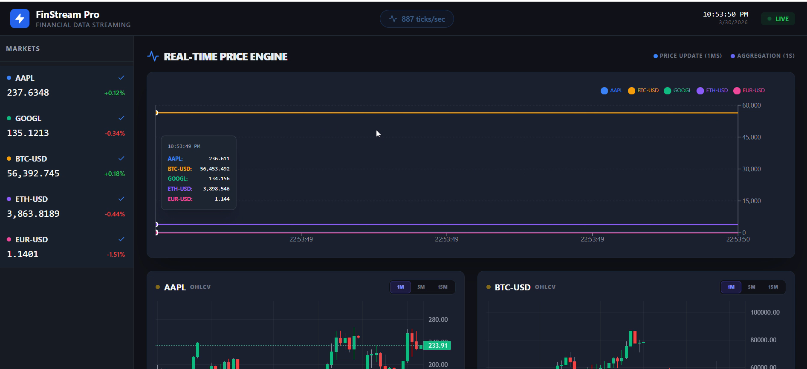
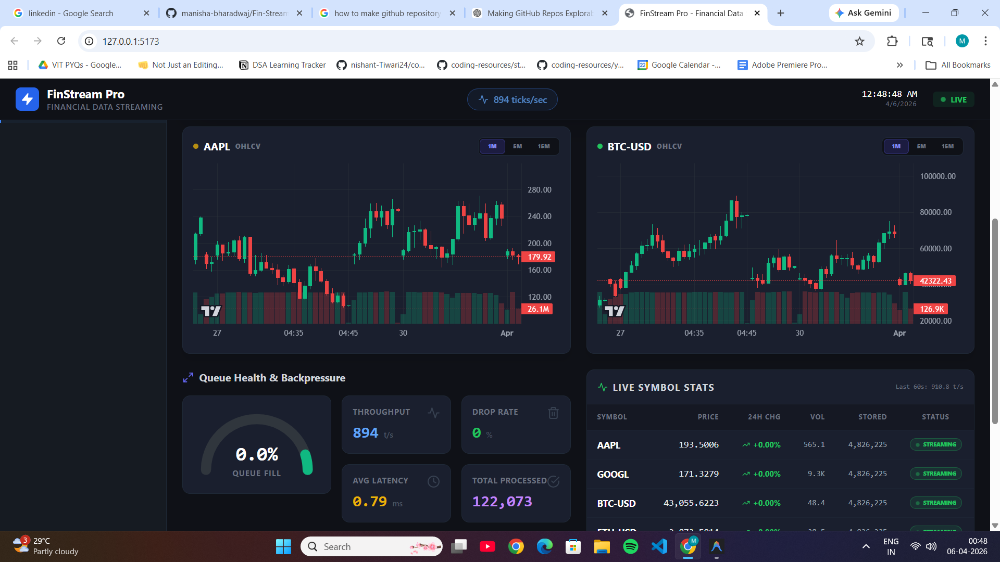
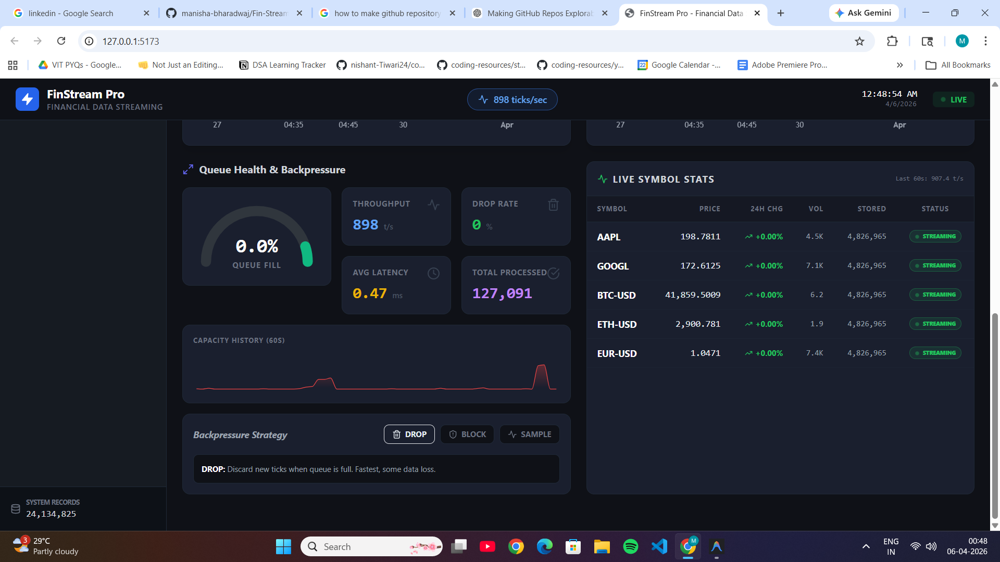

# FinStream Pro — Financial Data Streaming System

## Purpose and Functionality
FinStream Pro is a real-time financial data streaming application. It helps to simulate live market data (like cryptocurrency and stock prices) so it can be analyzed easily. 

Additionally, this serves as an excellent operating systems and systems engineering project, as it actively demonstrates handling high-throughput data streams using advanced concepts like **backpressure**, multithreading, and bounded queues to gracefully handle data spikes. 

The frontend provides a live dashboard to monitor dynamic price charts, system throughput, and queue health in real-time, leveraging WebSockets for instant updates.

## Application Screenshots







## Tech Stack
* **Frontend:** React, Recharts (for live data visualization)
* **Backend:** Python, FastAPI
* **Database:** SQLite (with WAL mode for concurrent write/read access)
* **Containerization:** Docker & Docker Compose

## How to Run Locally

You can easily start and stop the complete application using the provided PowerShell scripts on Windows.

### Start the Application
Open a PowerShell terminal and run:
```powershell
.\start.ps1
```
This script will automatically install dependencies, start the backend server, and launch the frontend in the background. The dashboard will be available at: **http://127.0.0.1:5173**

### Stop the Application
To gracefully shut down both the server and the frontend, run the exact stop command below:
```powershell
.\stop.ps1
```
